# BudgetUp
BudgetUp - приложение для отслеживания расходов/доходов. С помощью этого приложения вы сможете добавлять информацию о своем бюджете и анализировать его с помощью различных графиков и диаграмм.

Для работы в данном приложении вам необходимо зарегистрироваться и зайти в личный кабинет.

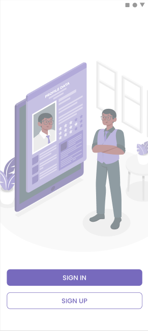
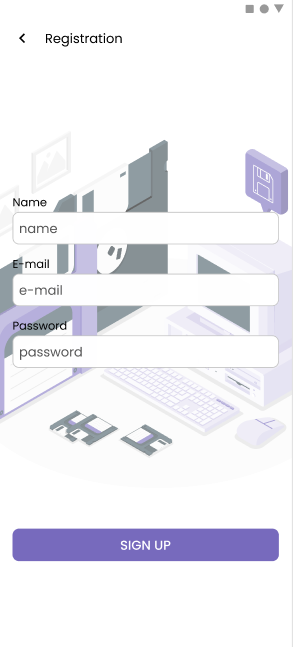
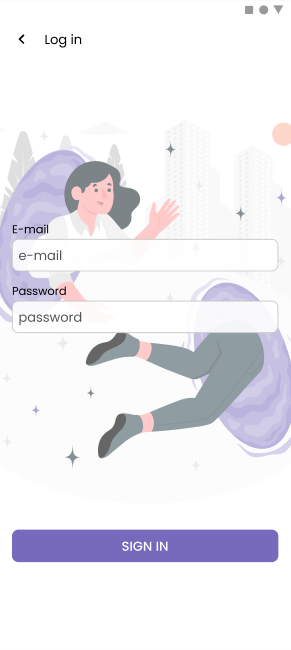

BudgetUp имеет три основные вкладки: Home, Statistics, Profile.

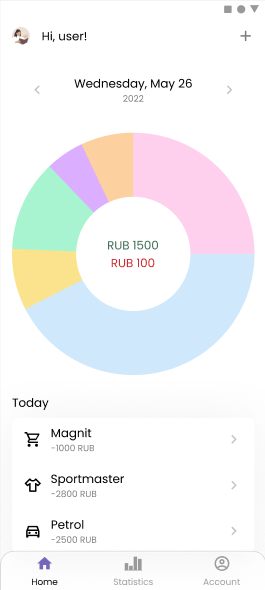
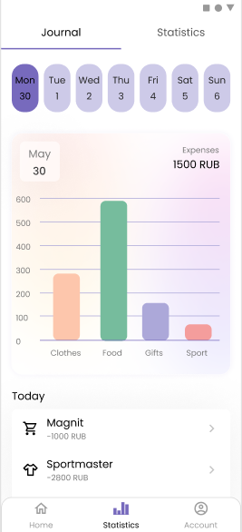
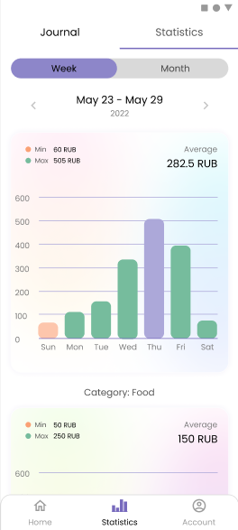
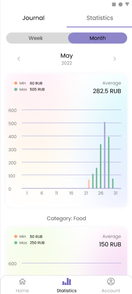
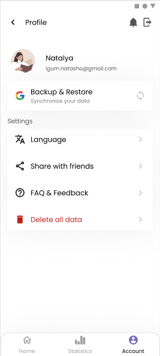

Вы можете добавить свои данные вручную. Также можете добавить информацию через загрузку Excel таблицы из банковского аккаунта.

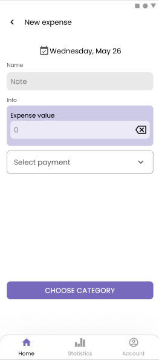
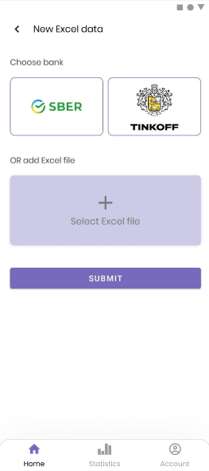

Создать уведомление для напоминания о регулярных платежах.

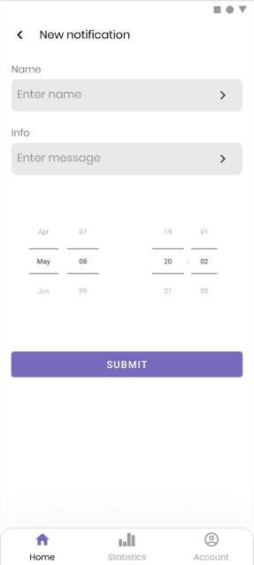
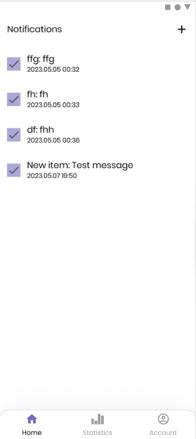
